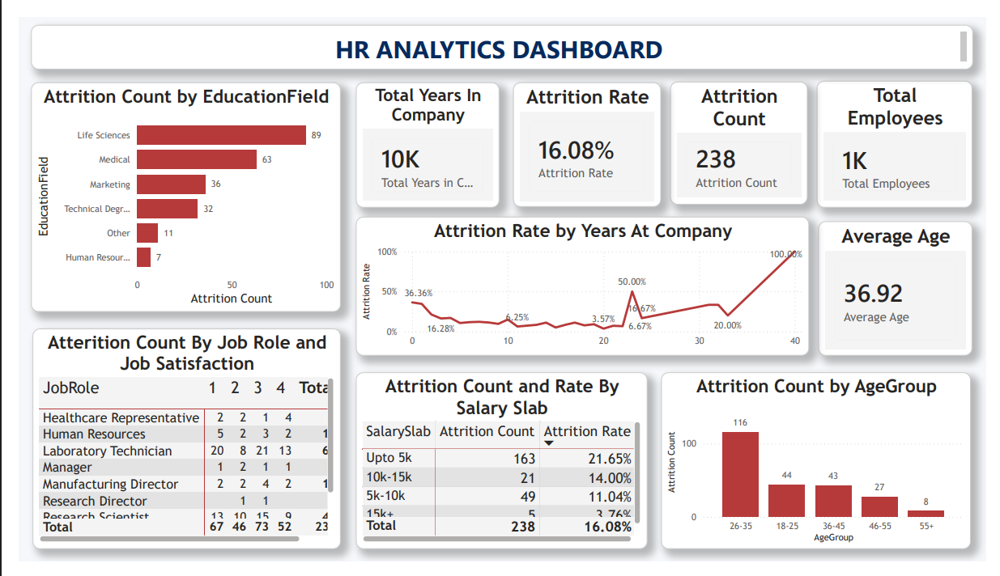

# HR Analytics Dashboard

An interactive Power BI dashboard designed to analyze employee attrition, workforce demographics, job satisfaction, salary levels, and years of service.

## Project Overview

This project presents an HR Analytics Dashboard developed using Microsoft Power BI.

The dashboard provides a consolidated view of employee attrition and workforce-related metrics. It enables analysis of attrition patterns across education fields, age groups, job roles, salary slabs, job satisfaction levels, and years spent at the company.

## Project Objective

The main objective of this project is to transform HR data into meaningful and interactive visual insights that can help understand employee attrition patterns and workforce characteristics.

The dashboard focuses on:

- Employee attrition analysis
- Attrition rate analysis
- Employee demographics
- Education field-wise attrition
- Age group-wise attrition
- Job role and job satisfaction
- Salary slab-wise attrition
- Attrition rate by years at company

## Key Metrics

| Metric | Value |
| Total Employees | 1K |
| Attrition Count | 238 |
| Attrition Rate | 16.08% |
| Average Age | 36.92 |
| Total Years in Company | 10K |

## Dashboard Features

### 1. Attrition Count by Education Field

Shows employee attrition across different education fields, including:

- Life Sciences
- Medical
- Marketing
- Technical Degree
- Other
- Human Resources

Life Sciences has the highest displayed attrition count at **89**, followed by Medical with **63**. 

### 2. Attrition Rate by Years at Company

Displays how employee attrition rate varies according to the number of years employees have spent at the company.

### 3. Attrition Count by Age Group

Analyzes attrition across different age groups:

- 18–25
- 26–35
- 36–45
- 46–55
- 55+

The **26–35 age group** has the highest displayed attrition count of **116**.

### 4. Attrition by Job Role and Job Satisfaction

Provides a detailed view of attrition across different job roles and job satisfaction levels.

Job satisfaction is represented on a scale from **1 to 4**.

### 5. Attrition Count and Rate by Salary Slab

Compares employee attrition across salary ranges:

- Up to 5K
- 5K–10K
- 10K–15K
- 15K+

The **Up to 5K** salary slab has the highest displayed attrition count (**163**) and an attrition rate of **21.65%**.

### 6. Interactive Dashboard Analysis

The dashboard combines multiple visualizations and KPI cards to provide an overall view of employee attrition and workforce characteristics.

## 💡 Key Insights

Based on the dashboard:

- The dashboard shows **1K total employees** and **238 employees in the attrition count**.
- Overall displayed attrition rate is **16.08%**.
- The average employee age is **36.92 years**.
- The **26–35 age group** records the highest displayed attrition count.
- **Life Sciences** has the highest displayed attrition count among the education fields.
- Employees in the **Up to 5K salary slab** show the highest displayed attrition count and attrition rate.
- Attrition rates vary considerably across different years at the company.

## Project Workflow

```text
Raw HR Dataset
       ↓
Data Cleaning
       ↓
Data Transformation
       ↓
Data Modeling
       ↓
DAX Measures
       ↓
Data Visualization
       ↓
Interactive Power BI Dashboard
       ↓
HR Insights
```

## Tools & Technologies

- Microsoft Power BI
- Power Query
- DAX
- Data Cleaning
- Data Transformation
- Data Visualization
- Business Intelligence

## Project Structure

```text
HR-Analytics-Dashboard/
│
├── Dashboard/
│   ├── dashboard.png
│   └── HR_Analytics_Dashboard.pdf
│
├── Dataset/
│   └── HR_Analytics.xlsx
│
├── Documentation/
│   └── HR_Analytics_Report.pdf
│
├── PowerBI/
│   └── HR_Analytics.pbix
│
├── .gitignore
└── README.md
```

## Dashboard Preview



## How to Use

1. Clone or download this repository.
2. Open the `.pbix` file from the `PowerBI` folder using Microsoft Power BI Desktop.
3. If required, update the dataset source path.
4. Refresh the data.
5. Explore the dashboard and analyze the available HR metrics and visualizations.

## Future Improvements

- Add department-wise attrition analysis
- Add gender-wise attrition analysis
- Add overtime and work-life balance analysis
- Add year-over-year attrition comparison
- Add interactive drill-through pages
- Add additional HR KPIs

## Author

**Tanya Sinha**

Data Analytics | Power BI | Data Visualization
